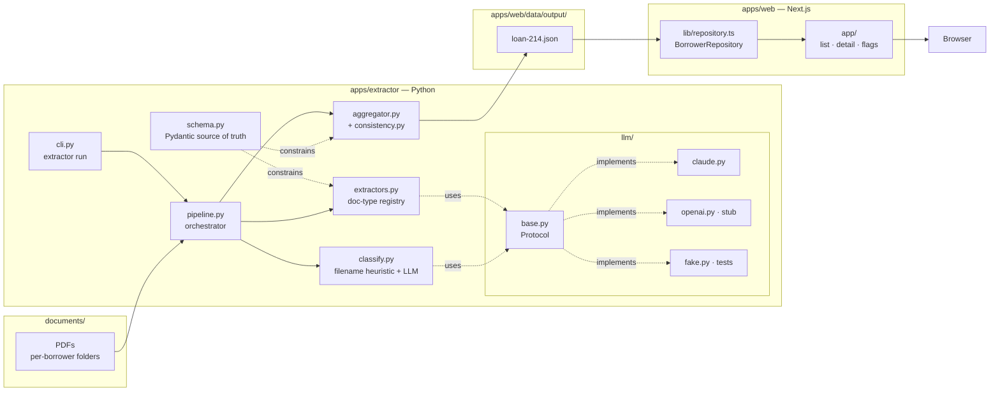

# System Design

A walkthrough of how the loan-document extractor is built and why. Companion to the [requirements](./requirements.md), [schema](./schema.md), and [task tracker](./tasks.md).

## Architecture



## Pipeline (left to right)

```
discover  →  classify  →  extract  →  aggregate  →  write JSON
```

1. **Discover.** Each subdirectory under `documents/` containing PDFs is one borrower. The folder name becomes the borrower ID (`Loan 214` → `loan-214`).
2. **Classify.** A filename heuristic resolves the easy cases for free; the LLM verifies and is the source of truth for anything ambiguous. Result includes a method tag (`heuristic` / `llm-verified` / `llm`) so the UI can show how confident we are.
3. **Extract.** A registry maps `DocumentType → (Pydantic schema, prompt)`. The pipeline looks up the entry and asks the LLM for *both* the strict-typed fields *and* a list of structured fields the LLM noticed but couldn't fit (single round-trip — see [novel-field detection](#novel-field-detection)).
4. **Aggregate.** Per-doc fields are merged into a single `Borrower` record. Multi-doc facts (legal name, address, SSN, loan ID, loan amount) are stored as `MultiSourced<T>`: a primary value plus alternates, each with provenance. No premature reconciliation.
5. **Cross-document consistency.** The aggregator runs a fixed set of conflict checks (subject-property address, loan ID, SSN drift, borrower-of-record). Each disagreement becomes an `ExtractionFlag(kind=CONFLICT)` shown in the UI.
6. **Write.** Output is one JSON file per borrower in `apps/web/data/output/`. The web app reads them through a `BorrowerRepository` interface — JSON today, easy swap to a database tomorrow.

## Data model

The Pydantic schema (`apps/extractor/src/extractor/schema.py`) is the canonical contract. The TypeScript mirror (`apps/web/lib/types.ts`) is hand-aligned today; codegen-from-JSON-Schema is a future hardening step.

Three patterns matter:

- **`Provenance` everywhere.** Every extracted scalar carries `{document_id, page, confidence, raw_text_excerpt?}`. The UI renders a provenance pill next to every value so the reviewer can trace any number back to the source PDF and page. This is the system's central promise.
- **`Sourced<T>` and `MultiSourced<T>`.** Single-source values use `Sourced<T>`; multi-source values use `MultiSourced<T>` to preserve every observation alongside a chosen primary. This is how we get reconciliation without losing the audit trail.
- **`KnownFields` discriminated union.** The per-doc extractors return strict-typed `*Fields` models (`PaystubFields`, `W2Fields`, etc.). The aggregator switches on type to decide what to do with each one, never on `isinstance` chains scattered through callers.

See [`docs/schema.md`](./schema.md) for the full per-doc field inventory.

## Cross-document consistency

The interesting design choice is that **the aggregator does not reconcile conflicting facts** — it picks a primary value via documented preference rules (most authoritative source per field type) and surfaces the conflict via a flag. The UI renders both. A human decides.

This corpus naturally surfaces several real conflicts that demonstrate the pattern:

| Conflict | Detail |
|---|---|
| Subject property address | Closing Disclosure says "999 Test Place, DC"; Form 1008 says "214 Overlook Drive, Brentwood TN"; Title Report says "9591 N Old Mill Way, FL". Three different addresses across three docs. |
| Borrower-of-record | The Title Report's proposed insureds (the VanAssen family) don't intersect the borrower set on the loan documents (the Homeowners). The system flags it as likely a misfiled doc. |
| SSN drift | Mary Homeowner's SSN differs between the 1040 (`500-22-2000`) and Form 1008 (`500-60-2222`). |
| Loan ID drift | `TEST250700110` on the Closing Disclosure vs `TEST250700114` on the Form 1008 — one digit off. |

Adding a new consistency check is a single function in [`consistency.py`](../apps/extractor/src/extractor/consistency.py) that yields zero or more `ExtractionFlag`s. Type-driven, no plumbing.

## Novel-field detection

The schema is closed at the per-doc-type level — each extractor returns a fixed Pydantic shape — but real documents contain fields that don't yet have a home. Examples from this corpus: `advice_number` on a paystub, `caivrs_number` on the Form 1008 addendum, page-level signature presence flags on the Title Report.

The Claude provider asks the LLM to return both the typed fields *and* a list of `NovelFieldHint`s in a single call. The aggregator emits one `ExtractionFlag(kind=NOVEL_FIELD)` per hint. The UI exposes them on `/flags` so a reviewer can promote a recurring novel field into the canonical schema (which is then a code change: edit `schema.py` + the relevant extractor entry).

This is a forward-evolution path, not a parallel pipeline.

## LLM provider abstraction

`LLMProvider` is a `runtime_checkable` Protocol with three methods (`extract_structured`, `extract_with_novelty`, `classify`). Three implementations:

- **`claude.py`** — production. Uses the Anthropic SDK with native PDF input (base64 `document` block — no OCR), adaptive thinking, prompt caching on system prompts, and `messages.parse(output_format=schema)` for typed Pydantic returns.
- **`openai.py`** — stub. Demonstrates the interface fits OpenAI's structured-output API; the file documents the recipe to make it real (Files API for PDFs, Responses API with `response_format=json_schema`).
- **`fake.py`** — deterministic test provider. Lookup by `(filename, schema_name)` from a dict of canned responses; logs every call for assertions. Tests run the entire pipeline end-to-end without touching the network.

Provider selection is one env var: `LLM_PROVIDER=claude` (default) or `openai`. Model selection is `LLM_MODEL=claude-opus-4-7` (default).

## Web app

Next.js 15 (App Router, TypeScript, Tailwind). Three routes:

- `/` — borrower list. Shows total income, source-doc count, flag count.
- `/borrowers/[id]` — full record. Identity, income history (table with provenance per row), accounts, loan, properties, flags, source documents. Every value carries a provenance pill linking back to its source PDF and page.
- `/flags` — cross-borrower flag queue, severity-sorted.

Data access goes through `lib/repository.ts` (`BorrowerRepository` interface). The current implementation reads JSON from `apps/web/data/output/`. Swap-in points for a database: change one constructor.

## Adding a new doc type

The whole loop:

1. Add a row to the inventory in [`docs/schema.md`](./schema.md).
2. Define a `*Fields` Pydantic class in `schema.py` and add it to the `KnownFields` union.
3. Add a `DocumentType` enum entry.
4. Add a row to `extractors.REGISTRY` binding the new `DocumentType` to its schema and a short instruction prompt.
5. (Optional) Add a filename pattern in `classify.py` for the heuristic fast-path; if you skip this, the LLM classifier will catch it.

That's it — no glue, no extra plumbing, no UI work (the UI renders generic field rows + flags).

## Trade-offs and known limitations

- **JSON-on-disk vs database.** Fine for a take-home; the repository pattern means the web app is unaware. A real deployment would swap in Postgres + a write-through audit table for the per-doc raw extractions.
- **Pydantic ↔ TypeScript types are hand-aligned.** Faster to ship; long-term the right move is generating the TS types from the Pydantic JSON Schema export. Build step, not a refactor.
- **Single borrower in the corpus.** The pipeline is built for N>1 (per-folder discovery) but only one is exercised. This was a deliberate choice — depth over breadth — given the time budget.
- **No PDF viewer in the UI yet.** Provenance pills point to a `(document_id, page)` tuple, but clicking through to the rendered PDF beside the extracted value is the obvious next step. Two-column view, PDF.js or an iframe; the data is already there.
- **Aggregator preference rules are hard-coded.** Reasonable defaults for now (1040 → W-2 → EVOE for legal name; CD → Form 1008 → Title for property; etc.). A real system would let underwriters override per-loan.
- **Cost of one corpus run.** Adaptive thinking + Opus 4.7 + multiple PDFs = a few dollars per run. Switch `LLM_MODEL` to `claude-sonnet-4-6` for a ~3× cost cut on dev iterations.
- **OCR.** Not implemented. Claude reads PDFs natively, including scanned-image pages, well enough for this corpus. A document with truly bad image quality would benefit from a preprocessing OCR pass; the provider abstraction is the place to add it.

## What I'd do with another week

- Codegen TS types from Pydantic JSON Schema (one-line correctness win).
- PDF viewer beside the borrower detail page; clicking a provenance pill jumps to the page.
- Persist extractions to Postgres; add a `/runs` history page so re-extractions are diffable.
- Add a real OpenAI implementation and run a side-by-side eval (where do the providers disagree on the same doc?).
- Better income reconciliation: explicitly compute the "qualifying income" with the rules underwriters actually use (e.g., 24-month average for self-employment).
- A `/runs/[id]/diff` page that shows what changed when you re-extract after a schema update.
